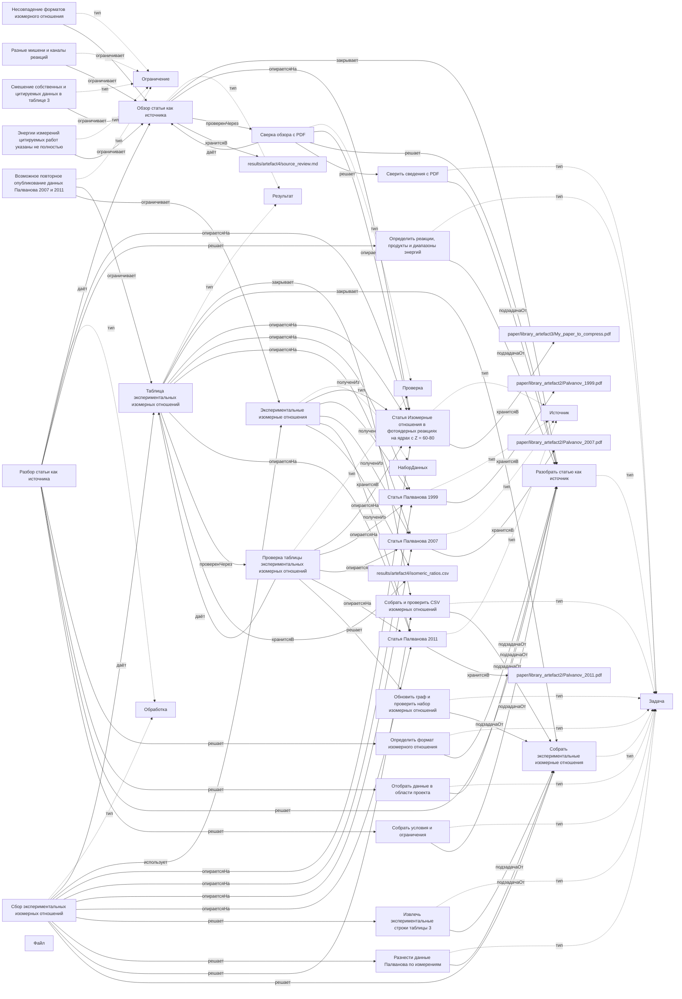

# Граф проекта

```mermaid
flowchart LR
  n0["Возможное повторное опубликование данных Палванова 2007 и 2011"]
  n1["Несовпадение форматов изомерного отношения"]
  n2["Обзор статьи как источника"]
  n3["Проверка таблицы экспериментальных изомерных отношений"]
  n4["Разбор статьи как источника"]
  n5["Разные мишени и каналы реакций"]
  n6["Сбор экспериментальных изомерных отношений"]
  n7["Сверка обзора с PDF"]
  n8["Смешение собственных и цитируемых данных в таблице 3"]
  n9["Статья Изомерные отношения в фотоядерных реакциях на ядрах с Z = 60-80"]
  n10["Статья Палванова 1999"]
  n11["Статья Палванова 2007"]
  n12["Статья Палванова 2011"]
  n13["Таблица экспериментальных изомерных отношений"]
  n14["Экспериментальные изомерные отношения"]
  n15["Энергии измерений цитируемых работ указаны не полностью"]
  n16["Задача"]
  n17["Источник"]
  n18["НаборДанных"]
  n19["Обработка"]
  n20["Ограничение"]
  n21["Проверка"]
  n22["Результат"]
  n23["Файл"]
  n24["paper/library_artefact2/Palvanov_1999.pdf"]
  n25["paper/library_artefact2/Palvanov_2007.pdf"]
  n26["paper/library_artefact2/Palvanov_2011.pdf"]
  n27["paper/library_artefact3/My_paper_to_compress.pdf"]
  n28["results/artefact4/isomeric_ratios.csv"]
  n29["results/artefact4/source_review.md"]
  n30["Извлечь экспериментальные строки таблицы 3"]
  n31["Обновить граф и проверить набор изомерных отношений"]
  n32["Определить реакции, продукты и диапазоны энергий"]
  n33["Определить формат изомерного отношения"]
  n34["Отобрать данные в области проекта"]
  n35["Разнести данные Палванова по измерениям"]
  n36["Разобрать статью как источник"]
  n37["Сверить сведения с PDF"]
  n38["Собрать и проверить CSV изомерных отношений"]
  n39["Собрать условия и ограничения"]
  n40["Собрать экспериментальные изомерные отношения"]
  n0 -.->|"тип"| n20
  n1 -.->|"тип"| n20
  n2 -.->|"тип"| n22
  n3 -.->|"тип"| n21
  n4 -.->|"тип"| n19
  n5 -.->|"тип"| n20
  n6 -.->|"тип"| n19
  n7 -.->|"тип"| n21
  n8 -.->|"тип"| n20
  n9 -.->|"тип"| n17
  n10 -.->|"тип"| n17
  n11 -.->|"тип"| n17
  n12 -.->|"тип"| n17
  n13 -.->|"тип"| n22
  n14 -.->|"тип"| n18
  n15 -.->|"тип"| n20
  n30 -.->|"тип"| n16
  n31 -.->|"тип"| n16
  n32 -.->|"тип"| n16
  n33 -.->|"тип"| n16
  n34 -.->|"тип"| n16
  n35 -.->|"тип"| n16
  n36 -.->|"тип"| n16
  n37 -.->|"тип"| n16
  n38 -.->|"тип"| n16
  n39 -.->|"тип"| n16
  n40 -.->|"тип"| n16
  n0 -->|"ограничивает"| n13
  n0 -->|"ограничивает"| n14
  n1 -->|"ограничивает"| n2
  n2 -->|"закрывает"| n36
  n2 -->|"опираетсяНа"| n9
  n2 -->|"проверенЧерез"| n7
  n2 -->|"хранитсяВ"| n29
  n3 -->|"даёт"| n13
  n3 -->|"опираетсяНа"| n9
  n3 -->|"опираетсяНа"| n10
  n3 -->|"опираетсяНа"| n11
  n3 -->|"опираетсяНа"| n12
  n3 -->|"решает"| n31
  n4 -->|"даёт"| n2
  n4 -->|"опираетсяНа"| n9
  n4 -->|"решает"| n32
  n4 -->|"решает"| n33
  n4 -->|"решает"| n34
  n4 -->|"решает"| n36
  n4 -->|"решает"| n39
  n5 -->|"ограничивает"| n2
  n6 -->|"даёт"| n13
  n6 -->|"использует"| n14
  n6 -->|"опираетсяНа"| n9
  n6 -->|"опираетсяНа"| n10
  n6 -->|"опираетсяНа"| n11
  n6 -->|"опираетсяНа"| n12
  n6 -->|"решает"| n30
  n6 -->|"решает"| n35
  n6 -->|"решает"| n38
  n6 -->|"решает"| n40
  n7 -->|"даёт"| n2
  n7 -->|"опираетсяНа"| n9
  n7 -->|"решает"| n36
  n7 -->|"решает"| n37
  n8 -->|"ограничивает"| n2
  n9 -->|"хранитсяВ"| n27
  n10 -->|"хранитсяВ"| n24
  n11 -->|"хранитсяВ"| n25
  n12 -->|"хранитсяВ"| n26
  n13 -->|"закрывает"| n38
  n13 -->|"закрывает"| n40
  n13 -->|"опираетсяНа"| n9
  n13 -->|"опираетсяНа"| n10
  n13 -->|"опираетсяНа"| n11
  n13 -->|"опираетсяНа"| n12
  n13 -->|"проверенЧерез"| n3
  n13 -->|"хранитсяВ"| n28
  n14 -->|"полученИз"| n9
  n14 -->|"полученИз"| n10
  n14 -->|"полученИз"| n11
  n14 -->|"полученИз"| n12
  n14 -->|"хранитсяВ"| n28
  n15 -->|"ограничивает"| n2
  n30 -->|"подзадачаОт"| n40
  n31 -->|"подзадачаОт"| n40
  n32 -->|"подзадачаОт"| n36
  n33 -->|"подзадачаОт"| n36
  n34 -->|"подзадачаОт"| n36
  n35 -->|"подзадачаОт"| n40
  n37 -->|"подзадачаОт"| n36
  n38 -->|"подзадачаОт"| n40
  n39 -->|"подзадачаОт"| n36
```

Схема показывает записанные связи; выводимые связи и классы в неё не добавляются.
